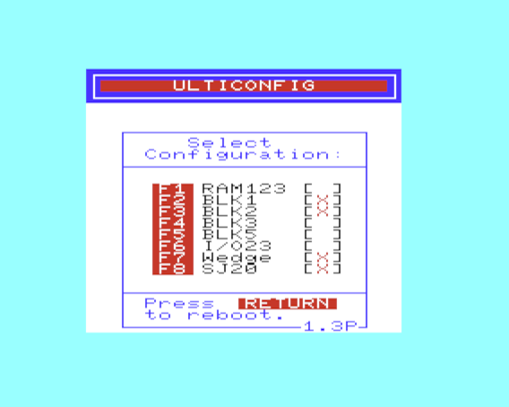
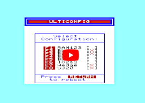

# UltiConfig for VIC-20 UltiMem cartridge

For more information about UltiMem visit
[RETRO Innovations](http://www.go4retro.com/products/ultimem/) page.

## UltiConfig features:

- Memory config selector
- DOS wedge ([miniwedge](https://github.com/ops/miniwedge))
- JiffyDOS speeder ([sj20](https://github.com/ops/sj20))

## Wedge Commands

|WEDGE COMMAND|DESCRIPTION|
|---|---|
|@|Display current drive error status|
|@"CMD"|Execute a disk drive command CMD|
|@"$"|Display the disk directory|
|@"$:PATTERN"|Display the disk directory of files matching PATTERN|

## Function keys

|KEY|USAGE|
|---|---|
|F1|Change to directory|
|F2| |
|F3|Load file from device 8 without secondary address|
|F4|Load file from device 8 with secondary address 1|
|F5|Move to the parent directory (or unmount disk image)|
|F6|Move to the root directory|
|F7|Display directory|
|F8| |

# Demo video

See UltiConfig in action!

# Releases

## Release v1.2 (2021-02-18)

Download [ulticonfig-v1.2.zip](releases/ulticonfig-v1.2.zip)
